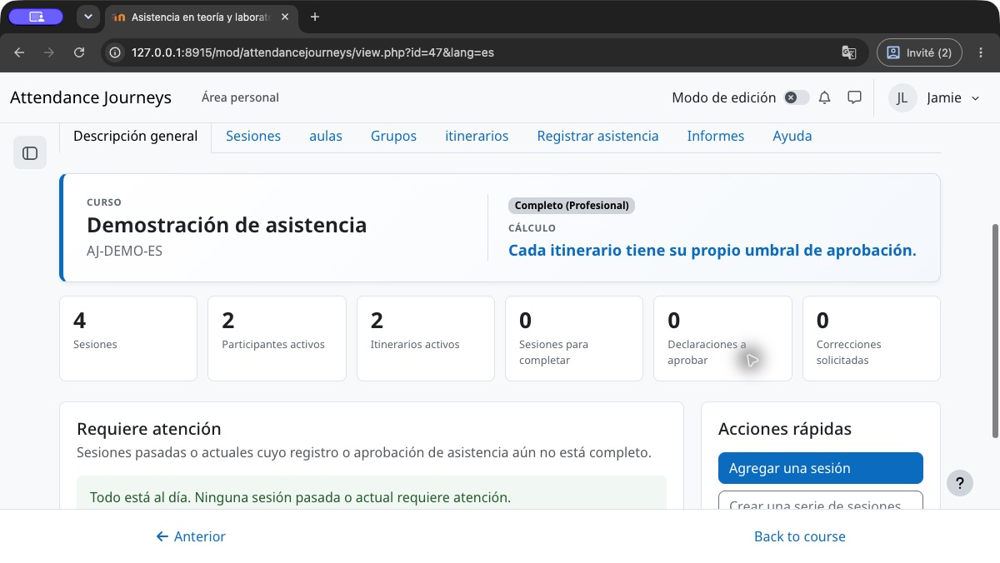
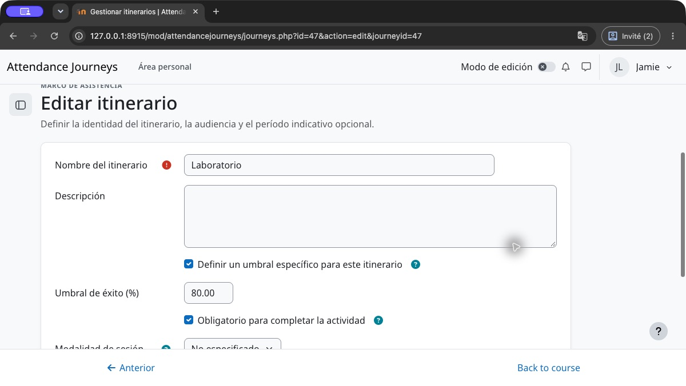
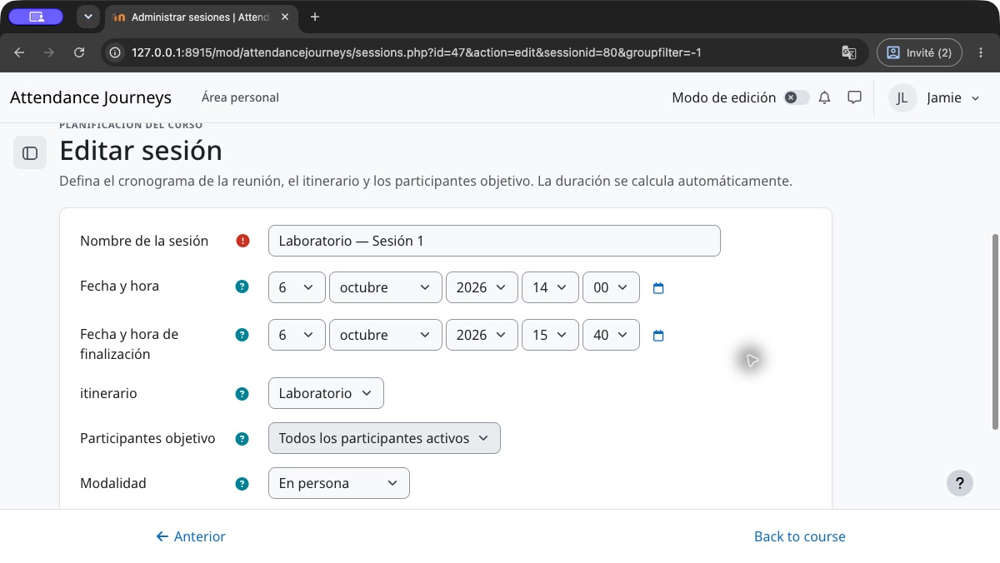
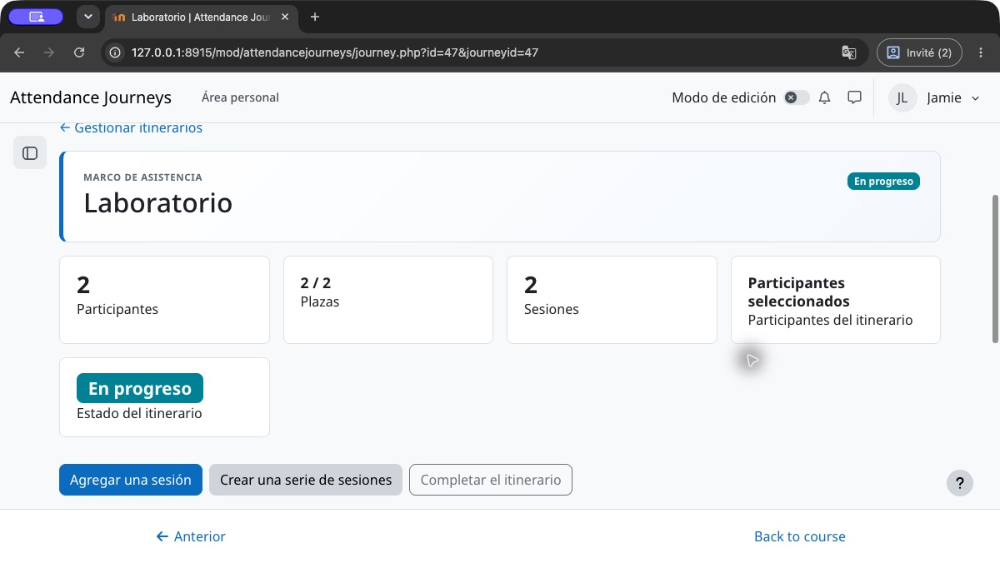
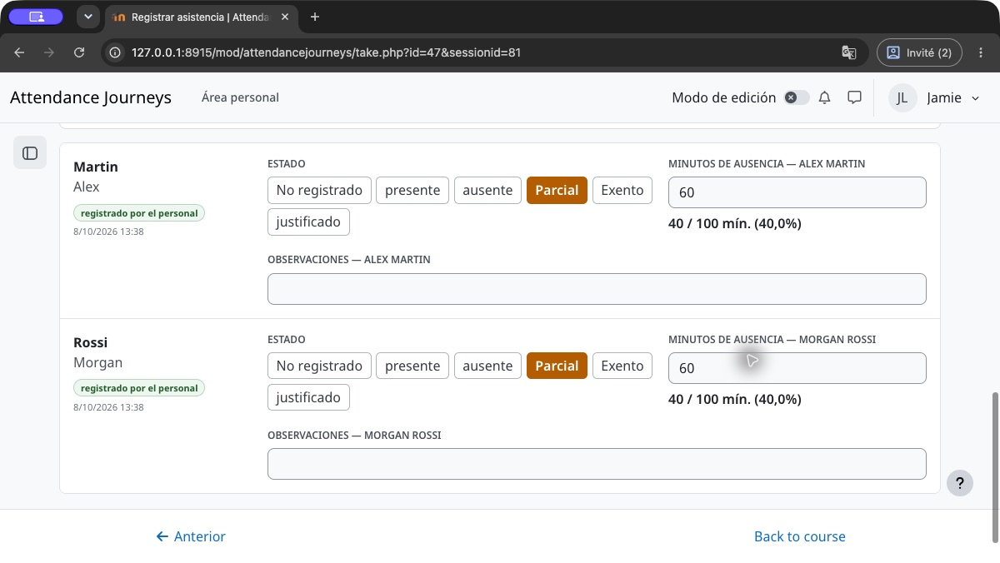
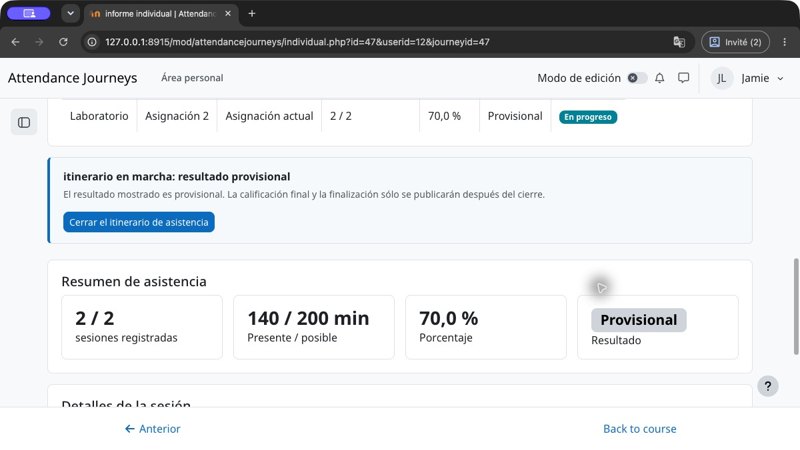
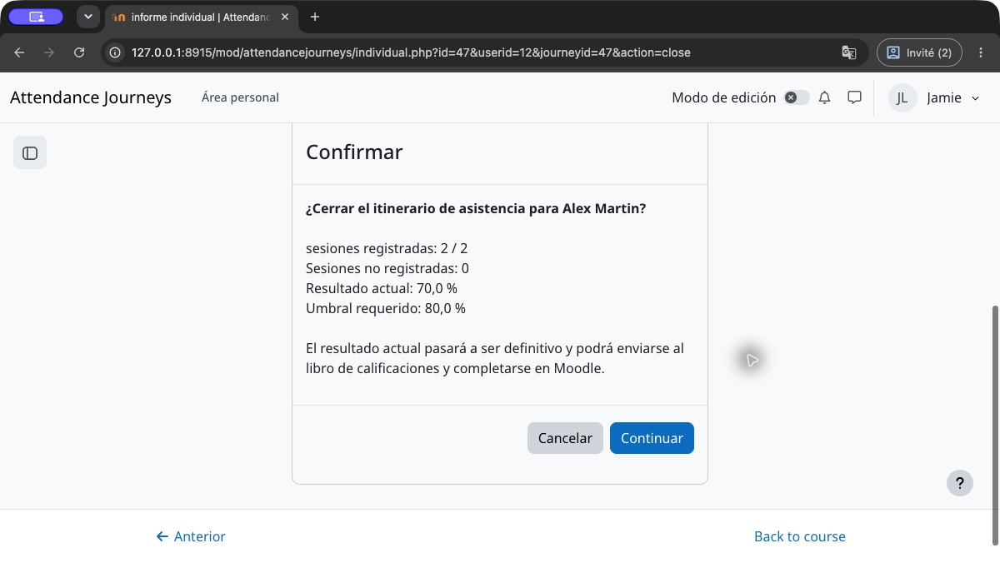
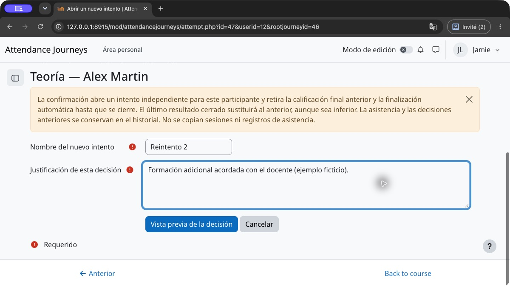

# Guía del usuario — Itinerarios de asistencia

## Empezar: su primer itinerario de asistencia

Esta guía describe las actividades nuevas que utilizan la calificación por itinerario. La pestaña **Ayuda** está disponible dentro de la actividad sin un servicio externo. Los permisos de Moodle, el modo y los ajustes institucionales determinan las acciones disponibles. En modo ligero, empiece con el itinerario principal; elija el modo profesional para varias obligaciones independientes o una gestión avanzada.

1. **Crear la actividad.** Elija el modo, el umbral de aprobación predeterminado y las condiciones de finalización. Se crea automáticamente un itinerario principal obligatorio.
2. **Definir la obligación.** Abra Itinerarios. Cambie el nombre del itinerario principal, elija sus participantes y, si procede, active su propio umbral. Para un laboratorio independiente, cree otro itinerario obligatorio. La misma persona puede seguir ambos.
3. **Planificar las sesiones.** En Sesiones, añada las reuniones al itinerario adecuado y establezca las horas de inicio y fin. Revise la duración calculada y los participantes antes de registrar la asistencia.
4. **Registrar la asistencia real.** En cada hoja, guarde Presente, Ausente o Parcial. La asistencia parcial utiliza minutos **ausentes**, no minutos presentes. Deje los casos sin resolver No registrado; apruebe las declaraciones cuando corresponda.
5. **Revisar el informe individual.** Compruebe los minutos exigidos, los registrados y el itinerario seleccionado. El porcentaje sigue siendo provisional mientras esta obligación esté abierta.
6. **Cerrar explícitamente.** Cuando todas las sesiones exigidas hayan terminado y se hayan resuelto los registros y aprobaciones, revise la confirmación de cierre. Confirme para publicar el resultado final de este itinerario. La finalización automática exige cerrar y aprobar cada obligación requerida asignada.

### Seguir el ejemplo ilustrado

Teoría exige **60%** y Laboratorio **80%**. Cada uno tiene dos sesiones de **100 minutos**. Alex asiste a toda la primera y falta **60 minutos** a la segunda: **140 / 200 = 70%**. Teoría está cerrada y aprobada; Laboratorio sigue provisional hasta su propio cierre. Cerrarlo al 70% publica un resultado fallido y no finaliza la actividad.

Las capturas utilizan participantes ficticios y el tema Boost de Moodle. La navegación y la presentación pueden variar con su tema. El texto, los pasos y los totales de minutos siguen siendo útiles sin las imágenes.

## 1. Objeto de la actividad

Itinerarios de asistencia centraliza la planificación de sesiones, el registro de asistencia, los cálculos y el cierre del resultado final. Un porcentaje provisional no se convierte automáticamente en un resultado final: cerrar el resultado de un participante o un itinerario confirma que el programa de asistencia previsto está completo.

La página principal resume el curso, el modo de funcionamiento, el umbral, los participantes, los itinerarios activos y los elementos que requieren atención.

El contador de progreso de sesiones describe las hojas de asistencia registradas; no significa que los resultados individuales estén cerrados ni que la actividad Moodle esté finalizada.

## 2. Configuración inicial

En la configuración de actividad de Moodle, elija:

- si se debe calcular un porcentaje de asistencia;
- el umbral de superación, por ejemplo el 80%;
- si el estado Justificado está disponible; su cálculo histórico configurable solo se aplica al modo histórico de calificación;
- si los estudiantes pueden declarar su propia asistencia;
- si las sesiones aparecen en el calendario de Moodle;
- las condiciones de realización de la actividad utilizadas por el curso.

La integración del calendario está deshabilitada de forma predeterminada para evitar eventos y notificaciones duplicados con Zoom, Teams, BigBlueButton u otra actividad.

### Preconfiguración institucional

Un administrador del sitio puede definir valores propuestos para todo el sitio en **Administración del sitio → Complementos → Módulos de actividad → Itinerarios de asistencia**. Cada valor también se puede bloquear. Se muestra un bloqueo en el formulario de actividad y se aplica en el lado del servidor. Una actividad existente adopta un valor bloqueado la próxima vez que se edita.

### Definir un umbral diferente

En Itinerarios, edite el itinerario independiente y active su propio umbral de aprobación. Introduzca 80 para Laboratorio mientras Teoría utiliza 60. Compruebe si la obligación es requerida y guarde. Cambiar una etiqueta no cambia el umbral. Un nuevo intento personal hereda el umbral de su obligación original.

## 3. Sesiones

En el modo nuevo, cada sesión pertenece a un itinerario y sigue su audiencia de participantes. Las actividades históricas también pueden utilizar sesiones independientes comunes o de grupo. La duración se calcula automáticamente a partir de las fechas y horas de inicio y finalización.

Las modalidades de entrega son presencial, online, híbrida o no especificada. Es posible que se proporcione un aula y un enlace de reunión en línea cuando sea necesario.

El estado No registrado permite al personal guardar una hoja de asistencia incompleta sin tratar a todos los participantes restantes como presentes.

### Interpretar los estados de las hojas de asistencia

| Estado | Acción |
|---|---|
| Asistencia incompleta | Abrir la hoja y resolver los registros obligatorios restantes. |
| Asistencia completa | Revisar o modificar la hoja con autorización; esto no cierra los resultados. |
| Sin participantes actuales | Revisar los participantes del itinerario y las matriculaciones activas de Moodle. No se ofrece una hoja vacía. Los registros históricos se conservan. |
| Sesión cancelada | El registro no está disponible. Revisar la cancelación o la restitución autorizada. |

El filtro de hojas incompletas identifica el trabajo pendiente; una sesión cancelada o sin participantes actuales no se considera incompleta simplemente por tener una lista vacía.

## 4. Itinerarios

Un itinerario agrupa las sesiones que definen una obligación de asistencia. Puede dirigirse a todos, a un grupo o a participantes seleccionados. En actividades profesionales nuevas, un participante puede seguir varios itinerarios simultáneos para obligaciones distintas. Las actividades históricas conservan la regla de un único itinerario activo hasta su conversión.

Cerrar el itinerario seleccionado congela su resultado final. Su reapertura vuelve provisional únicamente ese resultado. Los números de asignación identifican entradas del historial; las obligaciones simultáneas no se sustituyen. El crédito de asistencia no se transfiere automáticamente entre itinerarios: debe aprobarse una equivalencia autorizada.

La ficha de un itinerario reúne su audiencia, aforo, sesiones, período orientativo y acciones de cierre. Una audiencia automática sigue las inscripciones activas del curso o grupo Moodle; una audiencia seleccionada utiliza asignaciones explícitas al itinerario. Es el principal punto de control antes de publicar los resultados finales.

## 5. Registrar la asistencia

Los estados disponibles son Presente, Ausente, Parcial, Justificado cuando está habilitado y No registrado. En el modo nuevo, el personal autorizado también puede registrar Exento para un participante y una sesión. El estudiante no puede concederse una exención.

Para asistencia parcial, ingrese los minutos de ausencia. Por ejemplo, para una sesión de 360 ​​minutos con 35 minutos perdidos, Itinerarios de asistencia calcula automáticamente 325 minutos presentes.

Las acciones «Marcar todo…» aceleran el registro por parte del personal. Las excepciones individuales aún se pueden modificar antes de guardar.

En la hoja de una sesión, utilice primero los filtros y las acciones masivas y después trate las excepciones participante por participante. La hoja puede permanecer parcialmente registrada.

Las hojas muestran hasta 100 participantes por página. Guarde antes de cambiar de página. La búsqueda, los filtros y los botones de preparación de estados se aplican a las filas mostradas de esa página. El botón de aprobación incluye todas las declaraciones de la página actual, también las ocultas por un filtro. Revise la confirmación y repita en otras páginas cuando proceda.

En este ejemplo, 60 minutos ausentes de una sesión de 100 significan 40 minutos presentes. Con los 100 minutos de la primera sesión, el informe muestra 140 de 200 minutos exigidos. Guardar una hoja actualiza el cálculo provisional; no publica una calificación final.

## 6. Registro de la propia asistencia por el estudiante

Cuando esta función está habilitada, los estudiantes pueden declarar su asistencia a las sesiones admisibles. Nunca pueden consultar los informes de otros participantes ni modificar una entrada institucional, una declaración aprobada o un resultado final cerrado.

La página principal muestra únicamente sus propios itinerarios, resultados provisionales o finales, sesiones recientes y el acceso a su ficha detallada.

La página de registro en lote permite tratar varias sesiones admisibles en una sola lista y guardarlas en una única acción, sin ofrecer un estado global automático.

El personal puede aprobar una declaración correcta sin modificarla o solicitar una corrección mediante una nota. El estudiante podrá entonces corregirla y volver a enviarla.

El estudiante puede abrir su propio informe individual. Cualquier intento de consultar el informe de otro participante permanece protegido por la capacidad de Moodle para ver informes.

## 7. Informes y resultados

El informe colectivo muestra la audiencia autorizada. El informe individual muestra detalles de la sesión, cálculos, itinerario, resultados e historial de validación.

Los informes pueden redondear los porcentajes mostrados. La aprobación utiliza la proporción sin redondear entre minutos presentes y minutos exigidos: 1999/2500 minutos equivale al 79,96%, por lo que no aprueba un umbral del 80% aunque se muestre 80,0%. El redondeo mostrado nunca cambia una decisión cerrada ni genera la finalización. Consulte los totales de minutos y el resultado registrado para comprobar un caso próximo al umbral.

Los resultados provisionales no deberían generar certificados. Utilice el cierre manual para confirmar que un participante ha completado todas las sesiones esperadas. Luego, la calificación de Moodle y las condiciones de finalización se sincronizan de acuerdo con la configuración de la actividad.

Abra el nombre de un participante para consultar sus asignaciones a itinerarios, las equivalencias autorizadas y el detalle de todas las sesiones aplicables. Utilice la acción específica de nuevo intento para repetir una obligación; la reasignación por sí sola no abre uno.

El número de asignación identifica la asignación sucesiva del participante a un itinerario dentro de esta actividad. La asignación 2 puede ser una obligación de laboratorio diferente; no significa un segundo intento del mismo itinerario.

El selector de exportación de Moodle ofrece los formatos disponibles en el sitio, incluidos CSV, Excel, HTML, JSON, ODS y PDF.

## 8. Administración y auditoría

La pestaña Administración está restringida a usuarios con una capacidad de reinicio excepcional, normalmente administradores del sitio. Restablecer elimina los datos de Itinerarios de asistencia sin eliminar la cuenta de Moodle, la inscripción al curso o los grupos.

El registro de auditoría es de sólo lectura. Conserva la creación y actualización de asistencia, la aprobación, el retiro de la aprobación, la solicitud de corrección y el reenvío, junto con la fecha y el usuario responsable.

## 9. Exportar, realizar copias de seguridad y restaurar

Los informes se pueden exportar como CSV, Excel, JSON, ODS, HTML y PDF. Las copias de seguridad de la actividad de Moodle conservan sesiones, itinerarios, miembros, registros de asistencia, resultados finales e historial de auditoría cuando se incluyen datos del usuario.

## Cancelar o restituir una sesión

En el modo de calificaciones por itinerario, un profesor editor autorizado puede cancelar una sesión desde la página de sesiones indicando un motivo. La sesión y sus registros se conservan, pero su tiempo queda excluido de las obligaciones y del cálculo. No se puede registrar asistencia mientras esté cancelada. La restitución exige otro motivo y reincorpora la sesión; ambas decisiones permanecen en el historial. Primero hay que reabrir cierres activos y resolver equivalencias pendientes/aprobadas que la referencien. Cancelar todas las sesiones no aprueba automáticamente el itinerario. Si la sesión cambia, revise una confirmación actualizada.

Una sesión futura cancelada no impide el cierre cuando las demás sesiones obligatorias han terminado y están registradas. Tras reabrir el itinerario y restituir esa sesión, vuelve a ser obligatoria; debe alcanzarse su final previsto antes de cerrar de nuevo.

## Dos itinerarios obligatorios: ejemplo práctico

| | Asistencia | Umbral | Estado | Libro de calificaciones |
|---|---:|---:|---|---|
| Teoría | 70 % | 60 % | Cerrado, aprobado | 70 % |
| Laboratorio | 70 % | 80 % | Abierto, provisional | Sin calificación |

La finalización permanece incompleta mientras Laboratorio esté abierto. Si se cierra al 70 %, se publica su calificación, pero no alcanza el umbral del 80 %: la finalización sigue incompleta. Reabrir Laboratorio retira únicamente su calificación final. Tras una corrección autorizada y el cierre al 80 %, ambos itinerarios obligatorios están aprobados. Moodle controla la agregación de calificaciones del curso; aprobar Teoría no compensa un Laboratorio obligatorio no aprobado.

## Revisar y confirmar el cierre final

En Informes, abra al participante y seleccione el intento actual de la obligación. Elija el cierre, lea los minutos, el umbral y el resultado propuesto, y confirme o cancele. Para varios participantes, la acción de cierre del itinerario presenta su propia confirmación. Si aparece un bloqueo, resuélvalo y obtenga una nueva vista previa; no sustituya un registro sin resolver por una ausencia solo para cerrar.

Reabrir retira el resultado final seleccionado y reevalúa la finalización antes de corregirlo. Moodle controla la agregación de calificaciones y las restricciones posteriores. Este plugin no revoca automáticamente un certificado o una decisión ya emitidos por otra actividad; siga el procedimiento de revisión de su institución.

## Nuevos intentos de la misma obligación

En el informe individual del participante, seleccione **Abrir un nuevo intento** después de cerrar el intento actual. El personal autorizado indica un nombre y una justificación, revisa la vista previa de las consecuencias y confirma o cancela. Una calificación bloqueada o sustituida manualmente en Moodle impide la apertura. Primero debe restablecerse una obligación dispensada.

La confirmación abre un intento personal independiente con el umbral de la obligación original. Planifique nuevas sesiones: no se copian sesiones ni registros de asistencia. Se retira la calificación final anterior y se vuelve a evaluar la finalización automática hasta cerrar el nuevo intento. El último resultado cerrado sustituye al anterior, aunque sea inferior; un resultado anterior más alto nunca se usa como alternativa. Reabrir el intento actual vuelve a retirar su resultado. Corregir un intento anterior conserva su historial sin cambiar cuál es el intento actual.

Una obligación conserva un solo elemento de calificación y un solo requisito de finalización para todos sus intentos. Las obligaciones independientes de teoría y laboratorio mantienen umbrales, calificaciones y requisitos propios. El número de asignación dentro de la actividad no es el número personal de intento de una obligación.

El informe individual de una obligación única abre directamente su intento actual. Con varias obligaciones, elija el intento actual o un enlace al historial. La asistencia y los cierres anteriores siguen disponibles. Los informes colectivos y las exportaciones Excel/PDF de un itinerario físico conservan sus datos; **Resultado final anterior** o **Intento anterior** significa que este resultado no determina la calificación actual. Las exportaciones por sesión incluyen **Estado del resultado del intento**, separado del estado de asistencia como Presente.

## Capacidad y lista de espera

En modo profesional, configure la capacidad y la lista de espera en los ajustes del itinerario. Una capacidad de 0 significa ilimitada. Para participantes seleccionados, añada a las personas elegibles del curso antes de registrar asistencia. Cuando el itinerario esté lleno, utilice la lista de espera y revise la promoción propuesta cuando quede una plaza libre. Una confirmación explícita autorizada puede superar la capacidad; no aumenta el límite configurado. Una entrada en espera no crea asistencia ni calificaciones.

Cuando existe historial de asistencia o un cierre, la composición de participantes queda protegida. Una promoción tardía o una reasignación no deben reescribir ese historial. Utilice obligaciones individuales autorizadas, exenciones de sesiones o un nuevo intento personal cuando proceda. Los participantes automáticos siguen las matriculaciones activas del curso o grupo; no se editan manualmente como una lista seleccionada. La capacidad de un aula es información de planificación distinta del límite del itinerario.

## Solicitar y aprobar una equivalencia

En modo profesional, abra el informe individual del participante y añada una equivalencia. Seleccione la sesión de destino exigida y una asistencia de origen registrada y elegible, explique la solicitud y guarde. Una solicitud pendiente no concede minutos. El personal autorizado la revisa y aprueba o rechaza; una equivalencia aprobada puede revocarse mediante la acción correspondiente.

La aprobación acredita solo los minutos realmente asistidos en origen, limitados a la duración de destino. No copia un itinerario completo ni transfiere crédito automáticamente por tener dos asignaciones. El mismo origen no puede utilizarse dos veces. Resuelva las decisiones vinculadas antes de retirar una obligación de destino o cancelar una sesión implicada, y reabra un resultado final antes de una corrección autorizada. Revise el informe actualizado antes del cierre.

## Resultados por itinerario en actividades nuevas

Las actividades nuevas crean un itinerario principal obligatorio. Añada sus sesiones y registre la asistencia. En modo profesional, un participante puede seguir varios itinerarios para obligaciones diferentes, por ejemplo teoría y laboratorio. Cada itinerario hereda el umbral de la actividad o utiliza un umbral propio.

Presente representa toda la duración, ausente cero minutos presentes y la asistencia parcial resta minutos de ausencia. En este modo, una ausencia justificada sigue siendo ausencia; una exención de sesión autorizada elimina esa obligación del participante. Un registro pendiente no se convierte automáticamente en ausencia. No deduzca una exención de la fecha de matriculación.

El porcentaje es provisional hasta el cierre explícito. Las sesiones futuras o todavía en curso, registros obligatorios pendientes y decisiones de aprobación sin resolver impiden el cierre. Cada obligación independiente publica la calificación final de su intento seleccionado. La finalización automática exige cerrar y aprobar todos los itinerarios obligatorios asignados; aprobar uno no finaliza otro. Los itinerarios opcionales no imponen condiciones obligatorias de finalización.

Mientras una obligación de itinerario no exenta siga abierta, la tabla de progreso de participantes muestra Provisional en la columna de resultado, aunque la asistencia mostrada esté por encima o por debajo del umbral. Solo el cierre del intento actual proporciona el resultado definitivo Aprobado o Fallido de esta obligación.

Reabra el itinerario correspondiente antes de corregir un resultado final. Los demás conservan sus resultados. Los bloqueos y calificaciones manuales del libro de Moodle pueden impedir cambios; consulte los avisos de protección.

Las actividades existentes conservan sus reglas históricas hasta una conversión autorizada. 

## Obligaciones individuales de itinerario

En el nuevo modo de calificación por itinerario, abra **Informes → participante → Obligación individual de itinerario**. El personal autorizado para editar la actividad puede eximir la obligación completa o definir un periodo individual explícito. Toda decisión, incluida la reincorporación, necesita un motivo. Primero debe reabrirse un resultado final; los bloqueos y modificaciones manuales del libro de Moodle siguen protegidos.

Deje ambas fechas desactivadas para exigir todas las sesiones aplicables. El inicio es inclusivo y el fin exclusivo. Una sesión completamente fuera del periodo se excluye; una sesión que lo solapa cuenta entera. Las fechas técnicas de matriculación y asignación nunca determinan estos límites. Por ejemplo, excluir una ausencia anterior de 100 minutos y conservar una sesión de 100 minutos con 20 minutos ausentes cambia el cálculo provisional de 80/200 a 80/100. La asistencia registrada permanece en el historial.

Seleccione **Vista previa de la decisión** para comparar minutos y sesiones antes y después, con exclusiones y reincorporaciones. **Editar** vuelve a la propuesta sin guardarla. **Confirmar esta decisión** conserva el motivo y el historial; no cierra el itinerario ni publica una calificación. Si cambian la asistencia, las obligaciones o los permisos desde la vista previa, obtenga una nueva. **Cancelar** conserva la obligación actual.

La exención completa ignora las fechas, retira esta obligación de la finalización automática requerida y no crea ninguna calificación ni aprobación artificial. Los demás itinerarios obligatorios todavía deben cerrarse y aprobarse. Si todas las obligaciones están exentas, la finalización automática sigue siendo falsa; una persona autorizada puede utilizar la decisión manual nativa de Moodle. Los resúmenes identifican la exención; los informes detallados conservan los minutos históricos y señalan las sesiones fuera de la obligación individual. Las equivalencias existentes pueden impedir retirar una sesión vinculada a una decisión pendiente o aprobada.

Una asistencia histórica real en un itinerario de origen posteriormente exento puede justificar una equivalencia expresamente aprobada. La exención no crea asistencia ni crédito automático. El crédito se limita a los minutos realmente asistidos y a la duración de destino; el origen solo puede utilizarse una vez. Las sesiones canceladas y la asistencia no oficial siguen siendo inadmisibles. No puede retirarse una sesión de destino con una equivalencia pendiente o aprobada sin resolver esa decisión.

El participante puede leer su historial de decisiones. Los demás participantes no pueden consultarlo. Una copia con usuarios incluye las decisiones y su historial; una copia de estructura los omite. Al restaurar con un desplazamiento de las fechas del curso, las sesiones y límites pedagógicos se desplazan juntos, mientras que las fechas de auditoría de decisiones y asistencia conservan sus valores históricos.

## Terminología propia del curso

El profesorado puede cambiar por separado los conceptos **Itinerario, Sesión, Participante y Aula** en francés, inglés y español cuando la administración no haya bloqueado el concepto correspondiente. Introduzca singular y plural únicamente en los idiomas que necesiten términos propios; los campos vacíos heredan sus etiquetas institucionales o estándar. Un cambio en francés no modifica el inglés ni el español. Solo cambia el vocabulario; el flujo de asistencia permanece igual.

Esta sección especializada aparece cerca del final de los ajustes y está contraída de forma predeterminada. El idioma del curso se muestra primero en filas compactas; utilice el control nativo de Moodle **Mostrar más** únicamente para modificar idiomas adicionales.

## Ayuda integrada

La pestaña **Ayuda** de la actividad ofrece esta guía y los documentos permitidos para su rol. El idioma sigue automáticamente su interfaz de Moodle y la documentación mostrada utiliza la terminología personalizada de la actividad.
