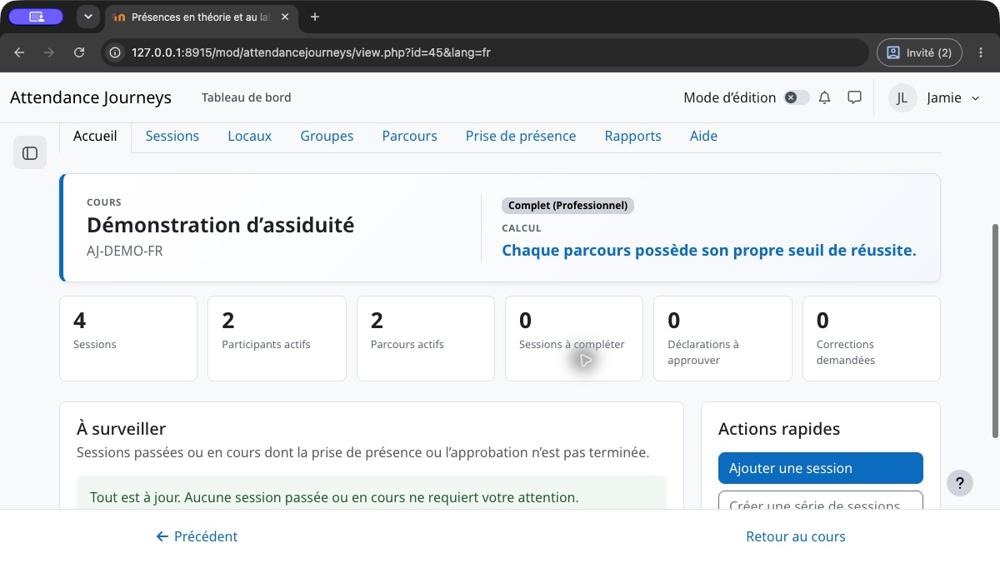
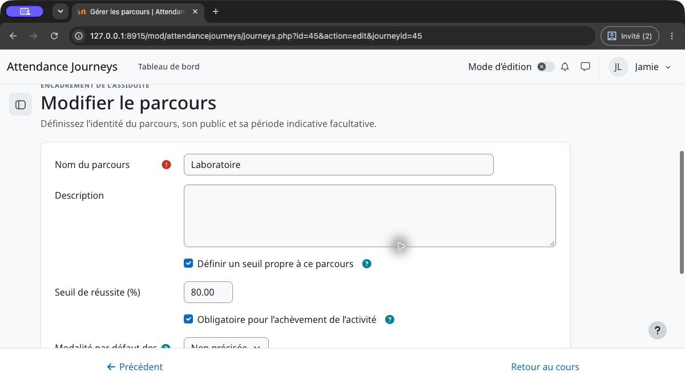
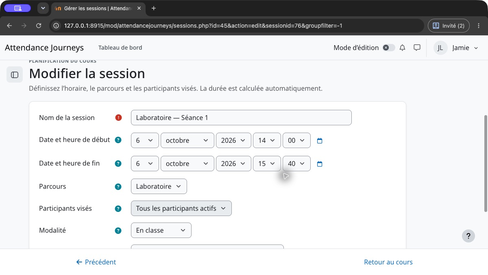
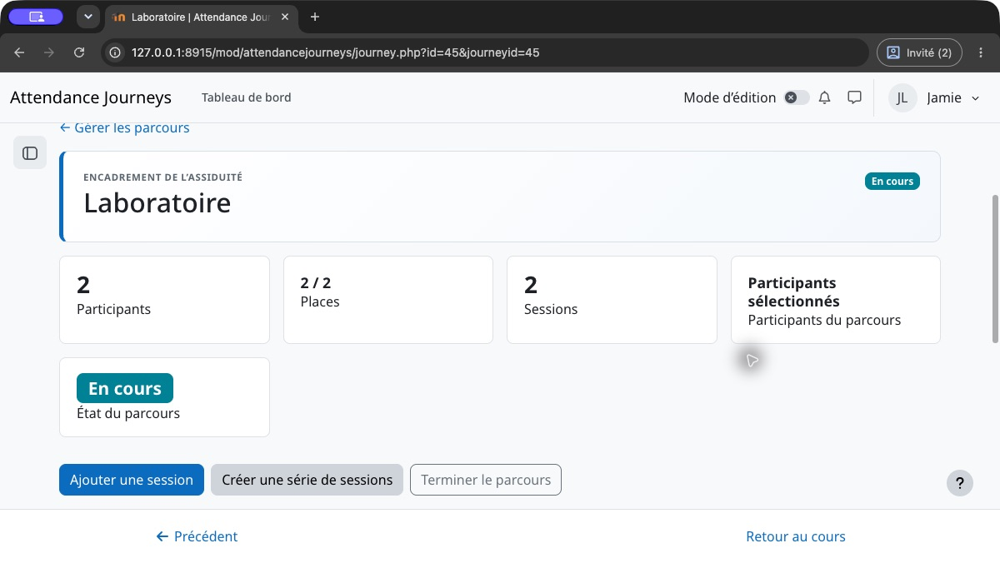
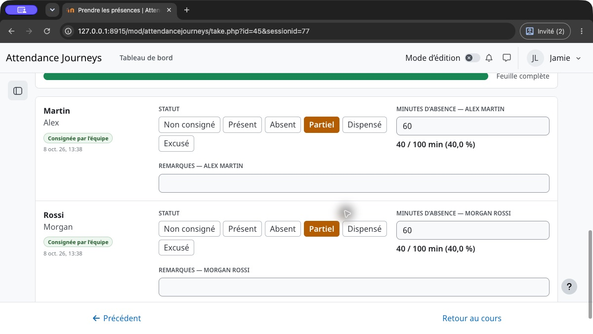
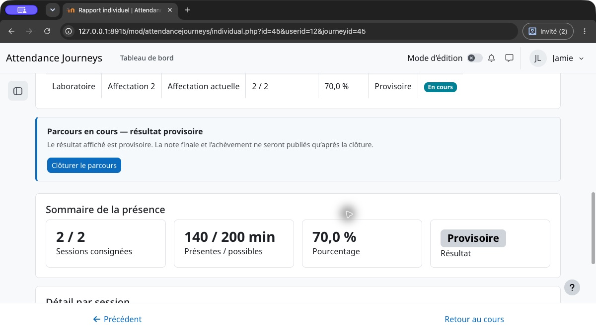
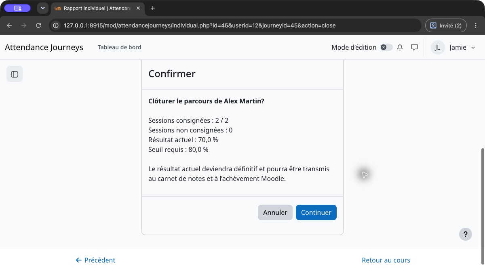
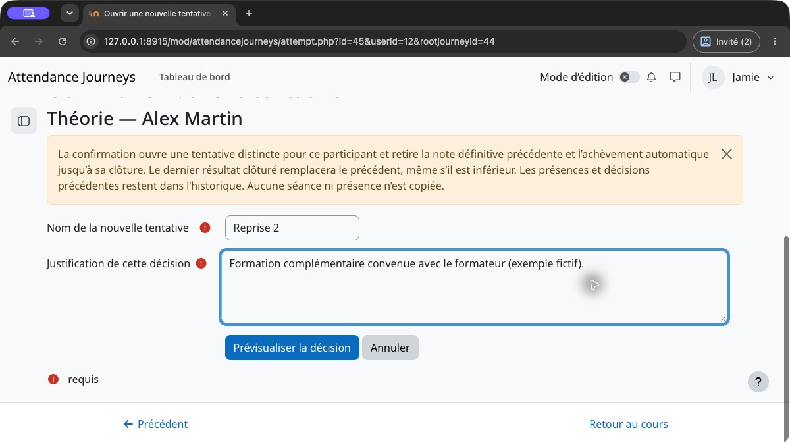

# Guide utilisateur — Parcours d’assiduité

## Commencer : votre premier parcours d’assiduité

Ce guide décrit les nouvelles activités utilisant la notation par parcours. L’onglet **Aide** est accessible dans l’activité sans service externe. Les permissions Moodle, le mode et les paramètres institutionnels déterminent les actions disponibles. En mode léger, commencez avec le parcours principal; choisissez le mode professionnel pour plusieurs obligations indépendantes ou une gestion avancée.

1. **Créer l’activité.** Choisissez le mode, le seuil de réussite par défaut et les conditions d’achèvement souhaitées. Un parcours principal obligatoire est créé automatiquement.
2. **Définir l’obligation.** Ouvrez Parcours. Renommez le parcours principal, choisissez son public et, au besoin, activez son propre seuil. Pour une obligation distincte de laboratoire, créez un autre parcours obligatoire. La même personne peut suivre les deux.
3. **Planifier les séances.** Dans Sessions, ajoutez les rencontres au bon parcours et fixez les heures de début et de fin. Vérifiez la durée calculée et le public avant la prise de présence.
4. **Consigner les présences réelles.** Sur chaque feuille, enregistrez Présent, Absent ou Partiel. La présence partielle utilise les minutes **absentes**, pas les minutes présentes. Laissez les cas non résolus Non consigné; approuvez les déclarations lorsque requis.
5. **Vérifier le rapport individuel.** Consultez les minutes exigées, les minutes consignées et le parcours sélectionné. Le pourcentage reste provisoire tant que cette obligation est ouverte.
6. **Clôturer explicitement.** Lorsque toutes les séances exigées sont terminées et les présences et approbations résolues, examinez la confirmation de clôture. Confirmez pour publier le résultat final de ce parcours. L’achèvement automatique exige que chaque obligation obligatoire affectée soit clôturée et réussie.

### Suivre l’exemple illustré

La théorie exige **60 %**, le laboratoire **80 %**. Chacun comporte deux séances de **100 minutes**. Alex suit toute la première et manque **60 minutes** de la seconde : **140 / 200 = 70 %**. La théorie est clôturée et réussie; le laboratoire reste provisoire jusqu’à sa propre clôture. Le clôturer à 70 % publie un échec et ne termine pas l’activité.

Les captures utilisent des participants fictifs et le thème Boost de Moodle. La navigation et la présentation peuvent varier selon votre thème. Le texte, les étapes et les totaux de minutes restent utilisables sans les images.

## 1. Rôle de l’activité

Parcours d’assiduité centralise la planification des rencontres, la prise de présence, le calcul de l’assiduité et la clôture du résultat d’un participant. Une présence provisoire ne devient pas automatiquement un résultat final : la clôture du parcours ou du participant confirme la fin de son cheminement.

La page d’accueil résume le cours, le mode de fonctionnement, le seuil, les participants, les parcours actifs et les éléments qui nécessitent une intervention.

Le compteur de progression des sessions décrit les feuilles de présence renseignées; il ne signifie pas que les résultats individuels sont clôturés ou que l’activité Moodle est achevée.

## 2. Paramètres initiaux

Dans les paramètres Moodle de l’activité, choisissez :

- si un pourcentage d’assiduité doit être calculé;
- le seuil de réussite, par exemple 80 %;
- si le statut « Excusé » est disponible; son calcul historique configurable concerne uniquement l'ancien mode de notation;
- si les étudiants peuvent déclarer eux-mêmes leur présence;
- si les sessions doivent apparaître dans le calendrier Moodle;
- les conditions d’achèvement utilisées par le cours.

L’intégration au calendrier est désactivée par défaut afin d’éviter des événements et notifications en double avec Zoom, Teams, BigBlueButton ou une autre activité.

### Préconfiguration institutionnelle

Un administrateur peut définir les valeurs proposées à l’échelle du site dans **Administration du site → Plugins → Modules d’activité → Parcours d’assiduité**. Chaque valeur peut également être verrouillée. Un verrou est affiché dans le formulaire de l’activité et il est aussi appliqué côté serveur. Une activité existante adopte une valeur verrouillée lors de sa prochaine modification.

### Définir un seuil distinct

Dans Parcours, modifiez le parcours indépendant et activez son propre seuil de réussite. Saisissez 80 pour le laboratoire alors que la théorie utilise 60. Vérifiez si l’obligation est obligatoire, puis enregistrez. Changer un libellé ne change pas le seuil. Une nouvelle tentative personnelle hérite du seuil de son obligation d’origine.

## 3. Sessions

Dans le nouveau mode de notation, chaque session appartient à un parcours et suit son public de participants. Les activités historiques peuvent aussi utiliser des sessions indépendantes communes ou de groupe. La durée est calculée automatiquement à partir des dates et heures de début et de fin.

Les modalités disponibles sont : en classe, en ligne, hybride ou non précisée. Un local et un lien de connexion peuvent être fournis lorsque nécessaire.

Le statut « Non consigné » permet d’enregistrer une feuille incomplète sans considérer automatiquement les autres participants comme présents.

### Comprendre les états des feuilles de présence

| État | Action |
|---|---|
| Présences incomplètes | Ouvrir la feuille et résoudre les présences exigées restantes. |
| Présences complètes | Vérifier ou modifier la feuille si autorisé; cela ne clôture pas les résultats. |
| Aucun participant actuel | Vérifier le public du parcours et les inscriptions Moodle actives. Aucune feuille vide n’est proposée. Les présences historiques sont conservées. |
| Séance annulée | La saisie est indisponible. Consulter l’annulation ou le rétablissement autorisé. |

Le filtre des feuilles incomplètes repère le travail restant; une séance annulée ou sans participant actuel ne devient pas incomplète simplement parce que son public est vide.

## 4. Parcours

Un parcours regroupe les sessions constituant une obligation d’assiduité. Il peut viser tous les participants, un groupe ou une liste choisie. Dans les nouvelles activités professionnelles, un participant peut suivre plusieurs parcours simultanément pour des obligations distinctes. Les activités historiques conservent leur règle d’un seul parcours actif jusqu’à conversion.

La clôture du parcours sélectionné fige son résultat final. Sa réouverture rend uniquement ce résultat provisoire. Les numéros d’affectation identifient les entrées de l’historique; les obligations simultanées ne se remplacent pas. Aucun crédit de présence ne passe automatiquement d’un parcours à l’autre : une équivalence autorisée doit être approuvée.

La fiche d’un parcours rassemble son public, sa capacité, ses sessions, sa période et les actions de clôture. Un public automatique suit les inscriptions actives du cours ou du groupe Moodle; un public sélectionné utilise des affectations explicites au parcours. Elle constitue le point de contrôle avant de publier les résultats finaux.

## 5. Prise de présence

Les statuts disponibles sont Présent, Absent, Partiel, Excusé lorsque cette option est activée, et Non consigné. Dans le nouveau mode de notation, le personnel autorisé peut aussi saisir Dispensé pour un participant et une session. L’étudiant ne peut pas s’accorder cette dispense.

Pour une présence partielle, saisissez les minutes d’absence. Par exemple, pour une session de 360 minutes avec 35 minutes manquées, Parcours d’assiduité calcule automatiquement 325 minutes présentes.

Les actions « Tous… » accélèrent la saisie du formateur. Chaque participant peut ensuite être corrigé individuellement avant l’enregistrement.

Dans la feuille d’une session, utilisez les filtres et les actions de masse, puis traitez les exceptions participant par participant. Une feuille peut demeurer partiellement consignée.

Les feuilles affichent au maximum 100 participants par page. Enregistrez avant de changer de page. Recherche, filtres et boutons de préparation des statuts concernent les lignes affichées de cette page. Le bouton d’approbation concerne toutes les déclarations de la page courante, y compris celles masquées par un filtre. Examinez la confirmation et recommencez sur les autres pages au besoin.

Dans cet exemple, 60 minutes absentes sur 100 donnent 40 minutes présentes. Avec les 100 minutes de la première séance, le rapport affiche 140 minutes sur 200 exigées. Enregistrer une feuille actualise le calcul provisoire; cela ne publie pas de note finale.

## 6. Déclaration par l’étudiant

Lorsque l’auto-saisie est autorisée, l’étudiant peut déclarer ses propres sessions admissibles. Il ne voit jamais les fiches des autres participants et ne peut jamais modifier une saisie institutionnelle, une déclaration approuvée ou un résultat final clôturé.

Son accueil présente uniquement ses propres parcours, ses résultats provisoires ou finaux, ses sessions récentes et un accès à sa fiche détaillée.

La page de déclaration en lot permet de traiter plusieurs sessions admissibles dans une seule liste et de tout enregistrer en une action, sans proposer de statut global automatique.

Le formateur peut approuver la déclaration telle quelle ou demander une correction avec une note. L’étudiant peut alors la corriger et la soumettre à nouveau.

L’étudiant peut ouvrir sa propre fiche individuelle. Toute tentative de consulter la fiche d’un autre participant demeure protégée par la capacité Moodle de consultation des rapports.

## 7. Rapports et résultats

Le rapport collectif présente l’ensemble du groupe autorisé. La fiche individuelle présente le détail des sessions, les calculs, le parcours, le résultat et l’historique des validations.

Les rapports peuvent arrondir les pourcentages affichés. La réussite est déterminée à partir du rapport non arrondi entre minutes présentes et minutes exigées : 1999/2500 minutes représente 79,96 %, donc un échec au seuil de 80 %, même si l’affichage indique 80,0 %. L’arrondi d’affichage ne modifie jamais une décision clôturée et ne crée pas d’achèvement. Consultez les totaux de minutes et le résultat enregistré pour vérifier un cas près du seuil.

Les résultats provisoires ne doivent pas servir à déclencher un certificat. Utilisez la clôture manuelle pour confirmer que le participant a terminé toutes les sessions attendues. La note Moodle et les conditions d’achèvement sont alors synchronisées selon les paramètres choisis.

Ouvrez le nom d’un participant pour consulter ses affectations aux parcours, les équivalences autorisées et le détail de toutes les sessions applicables. Utilisez l’action dédiée de nouvelle tentative pour une reprise; une réaffectation seule n’en ouvre pas.

Le numéro d'affectation identifie l'affectation successive du participant à un parcours dans cette activité. L'affectation 2 peut être une obligation de laboratoire distincte; elle ne désigne pas une deuxième tentative du même parcours.

Le sélecteur d’export Moodle propose les formats disponibles sur le site, notamment CSV, Excel, HTML, JSON, ODS et PDF.

## 8. Administration et audit

L’onglet Administration est réservé aux détenteurs de la permission de remise à zéro, normalement l’administrateur du site. Il permet une remise à zéro exceptionnelle des données Parcours d’assiduité sans supprimer le compte Moodle, l’inscription au cours ni les groupes.

Le journal d’audit est en lecture seule. Il conserve la saisie, la modification, l’approbation, le retrait d’approbation, la demande de correction et la nouvelle soumission, avec la date et la personne responsable.

## 9. Export, sauvegarde et restauration

Les rapports peuvent être exportés en CSV, Excel, JSON, ODS, HTML et PDF. La sauvegarde Moodle de l’activité conserve les sessions, parcours, membres, présences, résultats et historiques lorsque les données utilisateur sont incluses.

## Annuler ou rétablir une séance

En mode de notes par parcours, un enseignant éditeur autorisé peut annuler une séance depuis la page des séances en donnant une justification. La séance et ses présences restent visibles, mais son temps est exclu des obligations et du calcul. La saisie est indisponible pendant l’annulation. Le rétablissement exige une nouvelle justification et réintègre la séance; les deux décisions restent dans l’historique. Il faut d’abord rouvrir les clôtures actives et résoudre les équivalences en attente ou approuvées qui la référencent. Annuler toutes les séances ne valide pas automatiquement le parcours. Si la séance a changé, reprendre la confirmation depuis son état actuel.

Une séance future annulée ne bloque plus la clôture lorsque les autres séances exigées sont terminées et consignées. Après réouverture du parcours et rétablissement de cette séance, elle redevient obligatoire; il faut alors attendre sa fin prévue avant de clôturer à nouveau.

## Deux parcours obligatoires : exemple concret

| | Assiduité | Seuil | État | Carnet de notes |
|---|---:|---:|---|---|
| Théorie | 70 % | 60 % | Clôturé, réussi | 70 % |
| Laboratoire | 70 % | 80 % | Ouvert, provisoire | Aucune note |

L’achèvement reste incomplet tant que Laboratoire est ouvert. Sa clôture à 70 % publie sa note, mais son seuil de 80 % n’est pas atteint : l’achèvement demeure incomplet. La réouverture de Laboratoire retire uniquement sa note finale. Après correction autorisée et clôture à 80 %, les deux parcours obligatoires sont réussis. Moodle gère l’agrégation des notes du cours; une réussite en Théorie ne compense pas l’échec d’un Laboratoire obligatoire.

## Examiner et confirmer la clôture finale

Dans Rapports, ouvrez le participant et choisissez la tentative courante de l’obligation. Sélectionnez la clôture, lisez les minutes, le seuil et le résultat proposé, puis confirmez ou annulez. Pour plusieurs participants, l’action de clôture du parcours présente sa propre confirmation. Si un blocage est affiché, résolvez-le et obtenez un nouvel aperçu; ne remplacez pas une présence non résolue par une absence uniquement pour clôturer.

La réouverture retire le résultat final sélectionné et réévalue l’achèvement avant correction. Moodle contrôle l’agrégation des notes et les restrictions en aval. Un certificat ou une décision déjà émis par une autre activité n’est pas automatiquement révoqué par ce plugin; suivez la procédure de révision de votre établissement.

## Nouvelles tentatives pour une même obligation

Dans la fiche individuelle du participant, choisissez **Ouvrir une nouvelle tentative** après la clôture de la tentative courante. Le personnel autorisé fournit un nom et une justification, vérifie l’aperçu des conséquences, puis confirme ou annule. Un verrouillage ou une note imposée manuellement dans Moodle empêche l’ouverture. Une obligation dispensée doit d’abord être rétablie.

La confirmation ouvre une tentative personnelle distincte, avec le seuil de l’obligation d’origine. Planifiez ses nouvelles séances : aucune séance ni présence n’est copiée. La note définitive précédente est retirée et l’achèvement automatique est réévalué jusqu’à la clôture de la nouvelle tentative. Le dernier résultat clôturé remplace le précédent, même s’il est inférieur; un ancien meilleur résultat ne sert jamais de recours. Une réouverture de la tentative courante retire de nouveau son résultat. Corriger une ancienne tentative conserve son historique sans changer la tentative courante.

Une obligation conserve un seul élément de note et une seule exigence d’achèvement pour toutes ses tentatives. Les obligations indépendantes de théorie et de laboratoire gardent leurs seuils, notes et exigences propres. Le numéro d’affectation dans l’activité n’est pas le numéro personnel de tentative d’une obligation.

La fiche individuelle d’une obligation unique ouvre directement sa tentative courante. Avec plusieurs obligations, choisissez leur tentative courante ou un lien d’historique. Les anciennes présences et clôtures restent consultables. Les rapports collectifs et exports Excel/PDF d’un parcours physique conservent les données du parcours demandé; **Résultat final précédent** ou **Tentative précédente** signifie que ce résultat ne détermine pas la note actuelle. Les exports par séance comportent une colonne **Statut du résultat de la tentative**, distincte du statut de présence comme Présent.

## Capacité et liste d’attente

En mode professionnel, configurez la capacité et l’option de liste d’attente dans les paramètres du parcours. Une capacité de 0 signifie illimitée. Pour un public sélectionné, ajoutez les participants admissibles du cours avant de commencer la saisie. Lorsque le parcours est complet, utilisez la liste d’attente et examinez la promotion proposée lorsqu’une place se libère. Une confirmation explicite autorisée peut dépasser la capacité; elle n’augmente pas la limite configurée. Une inscription en attente ne crée aucune présence ni note.

Dès qu’un historique de présence ou une clôture existe, la composition du public est protégée. Une promotion tardive ou une réaffectation ne doit pas réécrire cet historique. Utilisez au besoin les obligations individuelles autorisées, les dispenses de séances ou une nouvelle tentative personnelle. Un public automatique suit les inscriptions actives du cours ou du groupe; il ne se modifie pas manuellement comme un public sélectionné. La capacité d’un local est une information de planification distincte de la limite du parcours.

## Demander et approuver une équivalence

En mode professionnel, ouvrez le rapport individuel du participant et ajoutez une équivalence. Choisissez la séance cible exigée et une présence source consignée admissible, expliquez la demande et enregistrez. Une demande en attente ne donne aucune minute. Le personnel autorisé l’examine, puis l’approuve ou la refuse; une équivalence approuvée peut être révoquée par l’action correspondante.

L’approbation crédite uniquement les minutes réellement suivies à la source, plafonnées à la durée cible. Elle ne copie pas un parcours entier et ne transfère rien automatiquement parce qu’une personne a deux affectations. Une même source ne peut servir deux fois. Résolvez les décisions liées avant de retirer une obligation cible ou d’annuler une séance concernée, et rouvrez un résultat final avant une correction autorisée. Vérifiez le rapport actualisé avant clôture.

## Résultats par parcours dans les nouvelles activités

Une nouvelle activité crée un parcours principal obligatoire. Ajoutez-y les séances et saisissez les présences. En mode professionnel, un participant peut suivre plusieurs parcours pour des obligations distinctes, par exemple théorie et laboratoire. Chaque obligation indépendante hérite du seuil de l’activité ou utilise son propre seuil.

La présence représente toute la durée, l'absence zéro minute présente et la présence partielle retranche les minutes d'absence. Dans ce mode de notation, une absence justifiée reste une absence; une dispense de séance autorisée retire cette obligation pour le participant. Une présence non renseignée reste en attente, sans devenir automatiquement une absence. Ne déduisez pas une dispense d'une date d'inscription.

Le pourcentage reste provisoire jusqu'à la clôture explicite. Les séances futures ou encore en cours, présences exigées manquantes et décisions d'approbation non résolues empêchent la clôture. Chaque obligation indépendante publie la note définitive de sa tentative sélectionnée. L'achèvement automatique exige que tous les parcours obligatoires affectés soient clôturés et réussis; réussir un parcours ne termine pas l'autre. Un parcours facultatif n'impose pas une condition d'achèvement obligatoire.

Tant qu’une obligation de parcours non dispensée reste ouverte, le tableau de progression des participants affiche Provisoire dans la colonne de résultat, même si le taux affiché est supérieur ou inférieur au seuil. Seule la clôture de la tentative courante fournit le résultat définitif Réussite ou Échec de cette obligation.

Rouvrez le parcours concerné avant de corriger un résultat final. Les autres conservent leurs résultats. Les verrouillages ou notes imposées manuellement dans le carnet Moodle peuvent empêcher une modification; consultez les avis de protection affichés.

Les activités existantes conservent leurs règles historiques jusqu'à une conversion autorisée. 

## Obligations individuelles de parcours

Dans le nouveau mode de notation par parcours, ouvrez **Rapports → participant → Obligation individuelle de parcours**. Le personnel autorisé à modifier l’activité peut dispenser l’obligation entière ou définir une période individuelle explicite. Toute décision, y compris un rétablissement, exige une justification. Un résultat final doit d’abord être rouvert; les verrouillages et notes imposées dans le carnet Moodle restent protégés.

Laissez les deux dates désactivées pour exiger toutes les séances applicables. Le début est inclusif et la fin exclusive. Une séance entièrement hors période est exclue; une séance qui la chevauche compte en entier. Les dates techniques d’inscription et d’affectation ne déterminent jamais ces bornes. Par exemple, exclure une absence antérieure de 100 minutes et conserver une séance de 100 minutes avec 20 minutes absentes fait passer le calcul provisoire de 80/200 à 80/100. Les présences enregistrées restent dans l’historique.

Cliquez sur **Prévisualiser la décision** pour comparer minutes et séances avant/après, avec exclusions et réintégrations. **Modifier** revient à la proposition sans enregistrer. **Confirmer cette décision** conserve la justification et l’historique; cette action ne clôture pas le parcours et ne publie aucune note. Si les présences, obligations ou droits ont changé depuis l’aperçu, obtenez un nouvel aperçu. **Annuler** conserve l’obligation actuelle.

La dispense entière ignore les dates, retire cette obligation de l’achèvement automatique requis et ne crée aucune note ni réussite artificielle. Les autres parcours obligatoires doivent encore être clôturés et réussis. Si toutes les obligations sont dispensées, l’achèvement automatique reste faux; une personne autorisée peut utiliser la décision manuelle native de Moodle. Les synthèses identifient la dispense; les rapports détaillés conservent les minutes historiques et signalent les séances hors obligation individuelle. Des équivalences existantes peuvent empêcher de retirer une séance concernée par une décision en attente ou approuvée.

Une présence historique réelle sur un parcours source ensuite dispensé peut justifier une équivalence explicitement approuvée. La dispense ne crée aucune présence ni aucun crédit automatique. Le crédit est plafonné aux minutes réellement suivies et à la durée cible; la source ne peut être utilisée qu’une fois. Les séances annulées et les présences non officielles restent inadmissibles. Une séance cible ayant une équivalence en attente ou approuvée ne peut être retirée sans résoudre cette décision.

Le participant peut lire son historique de décisions. Les autres participants ne peuvent pas le consulter. Une sauvegarde avec utilisateurs comprend les décisions et leur historique; une sauvegarde de structure les omet. Lors d’une restauration avec décalage du cours, les dates des séances et bornes pédagogiques se déplacent ensemble, tandis que les dates d’audit des décisions et présences conservent leur valeur historique.

## Terminologie propre au cours

Les enseignants peuvent renommer séparément les notions **Parcours, Session, Participant et Local** en français, en anglais et en espagnol lorsque l’administration n’a pas verrouillé la notion concernée. Utilisez le singulier et le pluriel de chaque langue, ou laissez les champs vides pour hériter des libellés institutionnels ou standards. Ainsi, « Séance » en français ne change pas automatiquement « Session » en anglais ni « Sesión » en espagnol. Seul le vocabulaire change; le fonctionnement demeure identique.

Cette section spécialisée se trouve vers la fin des paramètres et demeure repliée par défaut. La langue du cours apparaît immédiatement sous forme de lignes compactes; utilisez le mécanisme Moodle **Afficher plus** uniquement pour modifier les langues supplémentaires.

## Aide intégrée

L’onglet **Aide** de l’activité donne accès à ce guide et aux documents permis par votre rôle. La langue est choisie automatiquement selon votre interface Moodle et les termes personnalisés de l’activité sont appliqués à la documentation affichée.
