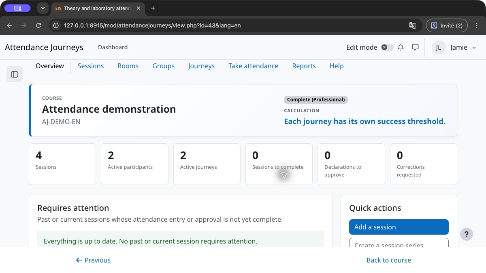
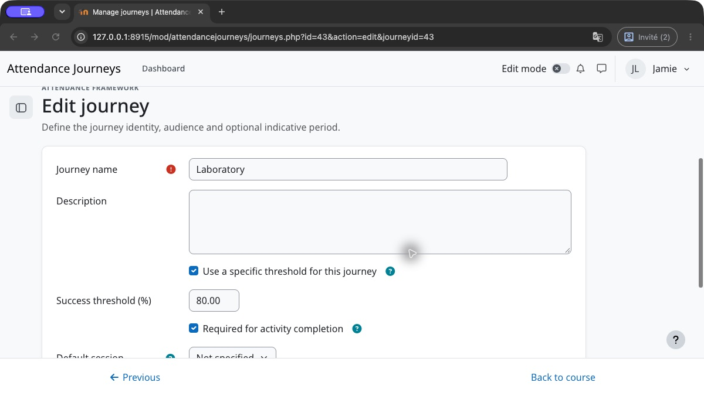
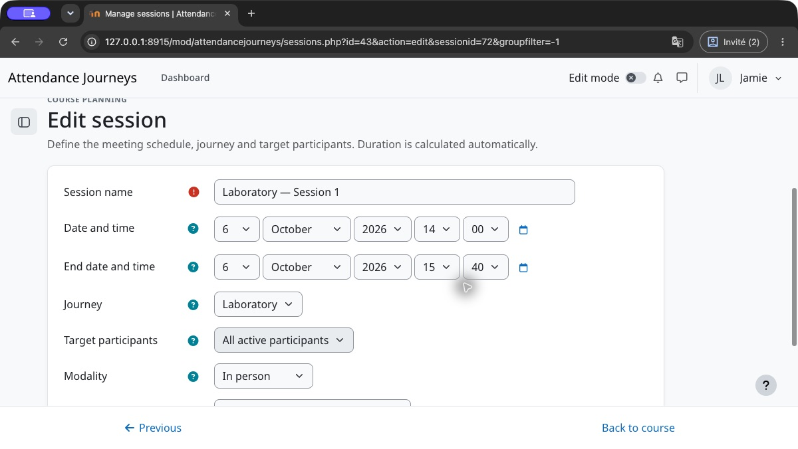
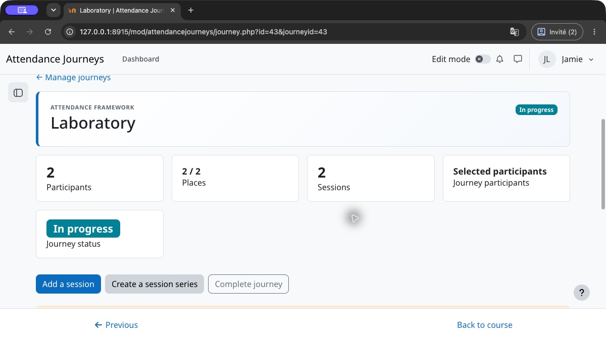
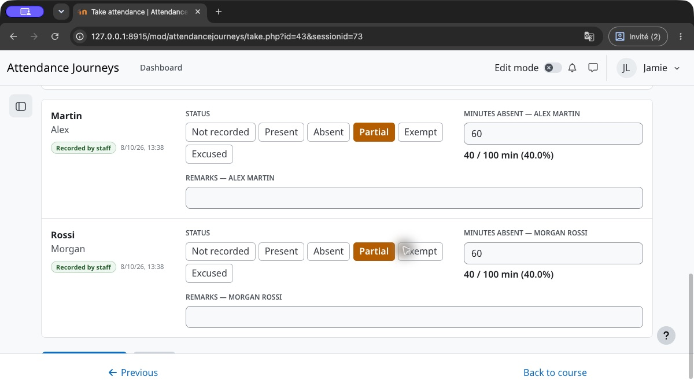
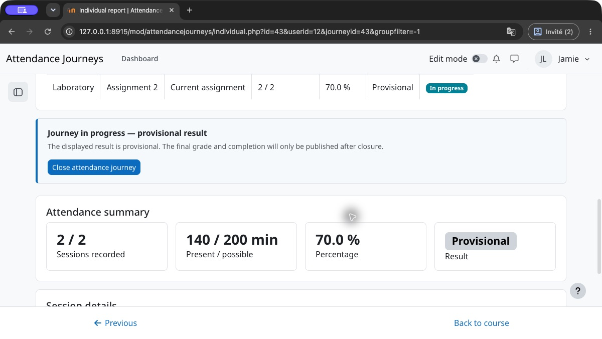
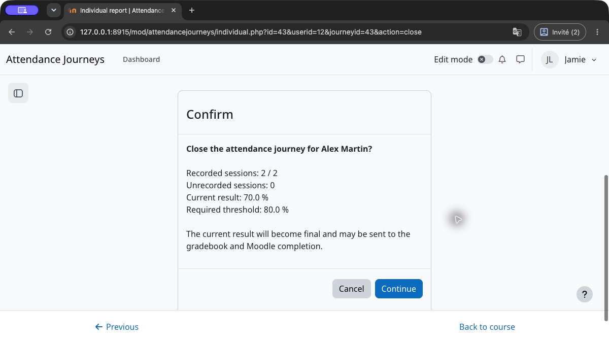
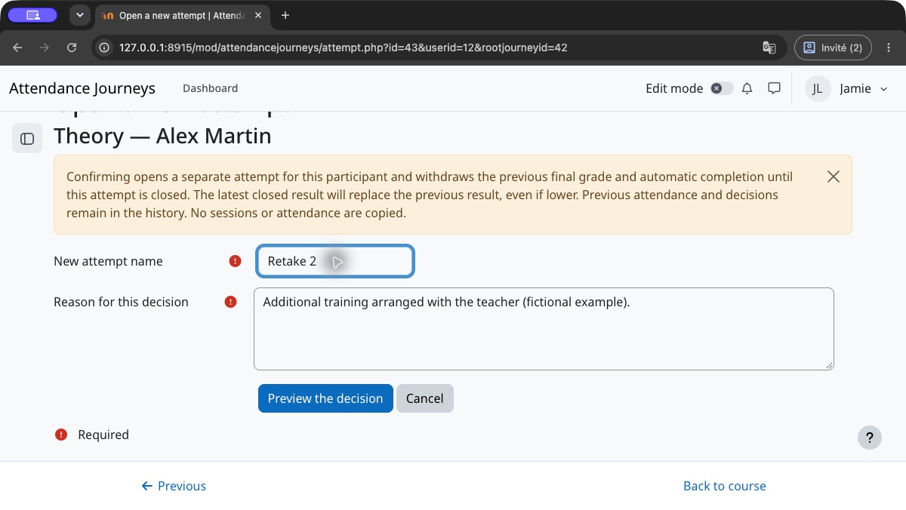

# User guide — Attendance Journeys

## Start here: your first attendance journey

This guide covers new activities using journey grading. The **Help** tab is available inside the activity without an external service. Moodle permissions, the operating mode and institutional settings determine which actions you see. In Light mode, start with the main journey; choose Professional mode when several independent obligations or advanced management are needed.

1. **Create the activity.** Choose the operating mode, a default passing threshold and the desired completion conditions. A required main journey is created automatically.
2. **Define the obligation.** Open Journeys. Rename the main journey, choose its audience and, if needed, enable its own threshold. For a separate laboratory obligation, create another required journey. The same person may belong to both.
3. **Plan the sessions.** Open Sessions, add the meetings to the correct journey and set their start and end times. Check the calculated duration and the audience before recording attendance.
4. **Record actual attendance.** On each attendance sheet, save Present, Absent or Partial. Partial uses minutes **absent**, not minutes present. Leave unresolved entries Unrecorded; approve declarations when required.
5. **Review the individual report.** Check required minutes, recorded minutes and the selected journey. A displayed percentage remains provisional while this obligation is open.
6. **Close explicitly.** Once all required sessions have ended and outstanding entries and approvals are resolved, review the closure confirmation. Confirm to publish this journey's final result. Required automatic completion needs every assigned required obligation to be closed and passed.

### Follow the illustrated example

Theory requires **60%**, Laboratory **80%**. Each has two **100-minute** sessions. Alex attends all of the first and misses **60 minutes** of the second: **140 / 200 = 70%**. Theory is closed and passed; Laboratory remains provisional until separately closed. Closing it at 70% publishes a failing result and does not complete the activity.

The screenshots use fictional participants and Moodle's Boost theme. Navigation and layout may differ with your theme. The text, steps and minute totals remain usable without the images.

## 1. Purpose of the activity

Attendance Journeys centralises meeting planning, attendance recording, attendance calculations and final result closure. A provisional percentage does not automatically become a final result: closing the participant or journey confirms that the expected attendance pathway is complete.

The home page summarises the course, operating mode, threshold, participants, active journeys and items that require attention. Its session progress counter describes recorded attendance sheets; it does not mean that participant results are closed or that the Moodle activity is complete.

## 2. Initial settings

In the Moodle activity settings, choose:

- whether to calculate an attendance percentage;
- the passing threshold, for example 80%;
- whether justified absence is available; its configurable historical calculation applies only to historical grading mode;
- whether students may declare their own attendance;
- whether sessions appear in the Moodle calendar;
- the activity-completion conditions used by the course.

Calendar integration is disabled by default to prevent duplicate events and notifications with Zoom, Teams, BigBlueButton or another activity.

### Institutional preconfiguration

A site administrator can define proposed site-wide values under **Site administration → Plugins → Activity modules → Attendance Journeys**. Each value can also be locked. A lock is shown in the activity form and is enforced server-side. An existing activity adopts a locked value the next time it is edited.

### Set a separate threshold

Open Journeys, edit the independent journey and enable its own passing threshold. Enter 80 for Laboratory while Theory uses 60. Check whether the obligation is required and save. Changing a display label does not change the threshold. A new personal attempt inherits its original obligation's threshold.

## 3. Sessions

In new grading mode, every session belongs to a journey and follows its participant audience. Historical activities may also use independent whole-course or group sessions. Duration is calculated automatically from the start and end dates and times.

Delivery modes are in person, online, hybrid or unspecified. A room and an online meeting link may be provided when needed.

The Unrecorded status lets staff save an incomplete attendance sheet without treating every remaining participant as present.

### Interpret attendance-sheet states

| State | What to do |
|---|---|
| Attendance incomplete | Open the sheet and resolve the remaining required entries. |
| Attendance complete | Review or modify the sheet when authorised; this does not close results. |
| No current participants | Check the journey audience and active Moodle enrolments. No empty attendance sheet is offered. Historical entries are retained. |
| Cancelled | Recording is unavailable. Review the cancellation or authorised reinstatement. |

The incomplete-sheet filter identifies work still needed; a cancelled session or one with no current participants does not become an incomplete sheet merely because its roster is empty.

## 4. Journeys

A journey groups the sessions that define one attendance obligation. It may target everyone, one group or selected participants. In new Professional activities, a participant may have several simultaneous journey assignments for distinct obligations. Historical activities retain their single-active-journey rule until conversion.

Closing the selected journey freezes its final result. Reopening it makes only that result provisional again. Assignment numbers identify historical entries; simultaneous obligations do not replace one another. Attendance credit is not transferred automatically between journeys: an authorised equivalence must be approved.

A journey page brings together its audience, capacity, sessions, indicative period and closure actions. An automatic audience follows active Moodle course or group enrolments; a selected audience uses explicit journey assignments. It is the main checkpoint before final results are published.

## 5. Taking attendance

Available statuses are Present, Absent, Partial, Excused when enabled, and Unrecorded. In new journey grading mode, authorised staff may also record Exempt for one participant and session. Students cannot grant themselves an exemption.

For partial attendance, enter minutes absent. For example, for a 360-minute session with 35 minutes missed, Attendance Journeys automatically calculates 325 minutes present.

The “Mark all…” actions accelerate staff entry. Individual exceptions can still be changed before saving.

On a session sheet, use filters and bulk actions first, then handle exceptions participant by participant. A sheet may remain partially recorded.

Attendance sheets display up to 100 participants per page. Save before changing pages. Search, filters and status-preparation buttons apply to the displayed rows on that page. The approval button covers all declarations on the current page, including declarations hidden by a filter. Review the confirmation and repeat on other pages when needed.

In this example, 60 minutes absent from a 100-minute session means 40 minutes present. With 100 minutes present in the first session, the journey report shows 140 of 200 required minutes. Saving a sheet updates the provisional calculation; it does not publish a final grade.

## 6. Student self-recording

When self-recording is enabled, students may declare their own eligible sessions. They never see other participants’ reports and cannot modify an institutional entry, an approved declaration or a closed final result.

Their home page shows only their own journeys, provisional or final results, recent sessions and access to their detailed report.

The bulk self-recording page lets students process several eligible sessions in one list and save them in a single action, without offering an automatic global status.

Staff may approve an accurate declaration without changing it or request a correction with a note. The student may then correct and resubmit it.

A student may open their own individual report. Any attempt to view another participant’s report remains protected by Moodle’s report-viewing capability.

## 7. Reports and results

The collective report shows the authorised audience. The individual report shows session details, calculations, journey, result and validation history.

Reports may round displayed percentages. Passing decisions use the unrounded ratio of present minutes to required minutes: 1999/2500 minutes is 79.96%, so it fails an 80% threshold even if the display reads 80.0%. Display rounding never changes a closed decision or creates completion. Use the minute totals and the recorded outcome when checking a borderline result.

Provisional results should not trigger certificates. Use manual closure to confirm that a participant has completed all expected sessions. The Moodle grade and completion conditions are then synchronised according to the activity settings.

Open a participant’s name to review their journey assignments, authorised equivalences and every applicable session in detail. Use the dedicated new-attempt action for a retake; reassignment alone does not open one.

The assignment number identifies the participant’s sequential journey assignment within this activity. Assignment 2 may be a separate laboratory obligation; it does not mean a second attempt at the same journey.

Moodle’s export selector provides the formats available on the site, including CSV, Excel, HTML, JSON, ODS and PDF.

## 8. Administration and audit

The Administration tab is restricted to users with the exceptional reset capability, normally site administrators. Reset removes Attendance Journeys data without deleting the Moodle account, course enrolment or groups.

The audit log is read-only. It retains attendance creation and update, approval, approval withdrawal, correction request and resubmission, together with the date and responsible user.

## 9. Export, backup and restore

Reports can be exported as CSV, Excel, JSON, ODS, HTML and PDF. Moodle activity backups retain sessions, journeys, members, attendance records, final results and audit history when user data is included.

## Cancel or reinstate a session

In journey grading mode, an authorised editing teacher can choose **Cancel session** on the Sessions page and supply a reason. The session and recorded attendance remain visible, but cancelled time does not contribute to attendance or required sessions. Recording is unavailable while cancelled. **Reinstate session** requires a new reason and restores its contribution. The history retains both decisions. Reopen an active final closure first and resolve pending/approved equivalences referencing the session. Cancelling every session does not automatically pass a journey. Review the fresh confirmation if the session has changed.

A future cancelled session does not block closure once the other required sessions have ended and been recorded. Reopening the journey and reinstating that session makes it required again; its scheduled end must then be reached before closing again.

## Two required journeys: a practical example

| | Attendance | Threshold | State | Gradebook |
|---|---:|---:|---|---|
| Theory | 70 % | 60 % | Closed, passed | 70 % |
| Laboratory | 70 % | 80 % | Open, provisional | No grade |

Completion remains incomplete while Laboratory is open. If it is closed at 70 %, its grade is published but its 80 % threshold is not met: completion still remains incomplete. Reopening Laboratory withdraws only its final grade. After an authorised correction and closure at 80 %, both required journeys have passed. Moodle controls course grade aggregation; a successful Theory result does not compensate for a failed required Laboratory journey.

## Review and confirm final closure

From Reports, open the participant and select the current attempt of the obligation. Choose the closure action, read the attendance total, threshold and proposed outcome, then confirm or cancel. For several participants, the journey's closure action provides its own confirmation. If a blocker is displayed, resolve it and obtain a fresh preview; do not substitute an absence for an unresolved entry simply to close.

Reopening withdraws the selected final result and re-evaluates completion before correction. Moodle controls grade aggregation and downstream restrictions. A certificate or other decision already issued by another activity is not automatically revoked by this plugin; follow your institution's review procedure.

## New attempts at the same obligation

In the participant’s individual report, open **Open a new attempt** after closing the current attempt. Authorised staff provide a name and a reason, preview the consequences, then confirm or cancel. A locked or manually overridden Moodle grade prevents the opening. A waiver must first be restored.

Confirmation opens a separate personal attempt with the original obligation’s threshold. Plan new sessions for it: no sessions or attendance are copied. The previous final grade is withdrawn and automatic completion is re-evaluated until the new attempt is closed. The latest closed result replaces the previous result even if lower; a higher earlier result is never used as a fallback. Reopening the current attempt withdraws its result again. Correcting a previous attempt keeps its history and does not change which attempt is current.

One obligation retains one grade item and one completion requirement across all its attempts. Independent theory and laboratory obligations retain separate thresholds, grades and requirements. An assignment number within the activity is not the personal attempt number for an obligation.

An individual report for one obligation opens its current attempt directly. With multiple obligations, choose the obligation’s current attempt or a history link. Previous attendance and closures remain available. Physical-journey collective reports and Excel/PDF exports retain the requested journey’s records; **Previous final result** or **Previous attempt** means this result does not determine the current grade. Session-level exports include a separate **Attempt result status** column, so an attendance status such as Present is not confused with publication of a final result.

## Capacity and waiting lists

In Professional mode, configure capacity and the waiting-list option in the journey settings. A capacity of 0 means unlimited. For a selected audience, add eligible course participants before attendance recording starts. When a journey is full, use the waiting list and review the proposed promotion when a place becomes available. An authorised explicit confirmation can exceed capacity; it does not increase the configured limit. A waiting-list entry alone creates no attendance or grade.

Once attendance history or a closure exists, audience membership is protected. Do not expect later waiting-list promotion or reassignment to rewrite that history. Use authorised individual obligations, session exemptions or a new personal attempt when appropriate. Automatic audiences follow active course or group enrolments; they are not manually edited like selected audiences. Room capacity is planning information and is distinct from the journey's participant limit.

## Request and approve an equivalence

In Professional mode, open the participant's individual report and add an equivalence. Select the required target session and eligible recorded source attendance, explain the request, and save. A pending request grants no minutes. Authorised staff review it, then approve or reject it; an approved equivalence can be revoked through the corresponding decision action.

Approval credits only the actual source minutes attended, capped at the target session duration. It does not copy a whole journey or automatically transfer credit because the person has two assignments. The same source cannot be credited twice. Resolve related decisions before removing a target obligation or cancelling an involved session, and reopen a final result before an authorised correction. Check the updated report before closure.

## Journey results in new activities

New activities create one required main journey. Add its sessions and record attendance. In Professional mode, a participant may follow several journeys for distinct obligations, such as theory and laboratory. Each independent obligation inherits the activity threshold or uses its own threshold.

Present means the full session duration, absent means zero minutes present, and partial attendance subtracts minutes absent. A justified absence remains absence in this grading mode; an authorised session exemption removes that participant's session obligation. Unrecorded attendance remains pending, not automatically absent. Do not infer an exemption from an enrolment date.

Percentages remain provisional until explicit closure. Future sessions and sessions still in progress, missing required records and unresolved approval decisions prevent closure. Each independent obligation publishes its selected final attempt’s grade. Automatic completion requires every assigned required journey to be closed and passed; passing one does not complete another. Optional journeys do not impose required completion conditions.

While a non-waived journey obligation is open, the participant progress table shows Provisional in its result column, even when the displayed attendance is above or below the threshold. Only an active closure supplies a final Passed or Failed result.

Reopen the selected journey before correcting a final result. Other journeys retain their results. Moodle gradebook locks and manual overrides may prevent grade changes; review the displayed protection notices.

Existing activities keep their historical grading and completion rules until an authorised conversion. 

## Individual journey obligations

In new journey grading mode, open **Reports → participant → Individual journey obligation**. Authorised editing staff may waive the entire obligation or set an explicit individual period. Every new decision, including reinstatement, needs a reason. A final result must be reopened first; Moodle gradebook locks and overrides remain protected.

Leave both date checkboxes disabled to require every applicable session. The start boundary is inclusive and the end boundary exclusive. Sessions wholly outside the period are excluded; a session overlapping it counts in full. Enrolment and assignment audit dates never infer these boundaries. For example, excluding an earlier 100-minute absence while retaining a 100-minute session with 20 absent minutes changes the provisional calculation from 80/200 to 80/100. Recorded attendance stays in the history.

Select **Preview the decision** to review minutes and sessions before and after, including exclusions and reinstatements. **Edit** returns to the proposal without saving. **Confirm this decision** records the reason and decision history; it does not close the journey or publish a grade. If attendance, obligations or access changed after preview, obtain a new preview. **Cancel** leaves the current obligation unchanged.

A whole-journey waiver ignores the dates, removes this obligation from required automatic completion and publishes no artificial grade or success. Other required journeys still have to be closed and passed. If all obligations are waived, automatic completion remains false; an authorised person may use Moodle's native manual completion decision. The summaries identify the waiver; detailed reports retain historical minutes and mark sessions outside the individual obligation. Existing equivalences can prevent removing a session involved in an unresolved or approved decision.

A real historical presence on a subsequently waived source journey can support an explicitly approved equivalence. Waiving the source creates no attendance and no automatic credit. Credit is capped at the actual minutes attended and the target duration, and the source can be used only once. Cancelled sessions and unofficial attendance remain ineligible. A target session with a pending or approved equivalence cannot be removed without resolving that decision.

The participant can read their decision history. Other participants cannot read it. Backup with users includes decisions and their history; structure-only backup omits them. When restoring with a course date offset, session dates and pedagogical boundaries move together, while decision and attendance audit timestamps retain their original dates.

## Local terminology

Teachers may rename the displayed **Journey, Session, Participant and Room** concepts separately in French, English and Spanish when site administration has not locked the relevant concept. Supply singular and plural values only for languages that need custom wording; blank fields inherit their institutional or standard labels. A French override therefore does not change English or Spanish. This changes wording only and does not alter the attendance workflow.

This specialised section appears near the end of the activity settings and is collapsed by default. The course language is shown first in compact rows; use Moodle’s native **Show more** control only when additional languages need editing.

## Integrated help

The activity’s **Help** tab provides this guide and the documents permitted for your role. It automatically follows your Moodle interface language and applies the activity’s customised business terminology to the displayed documentation.
